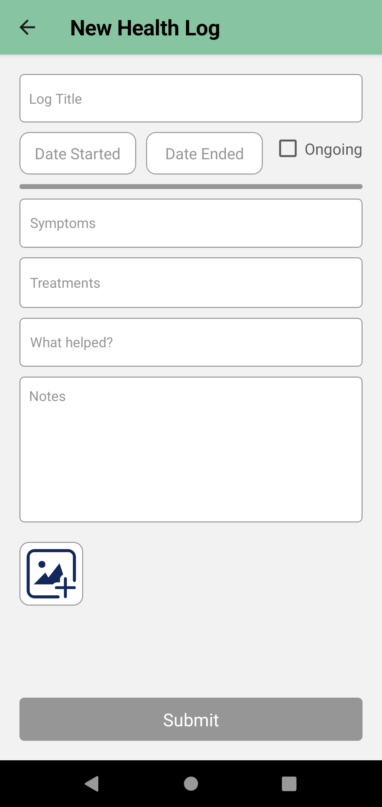
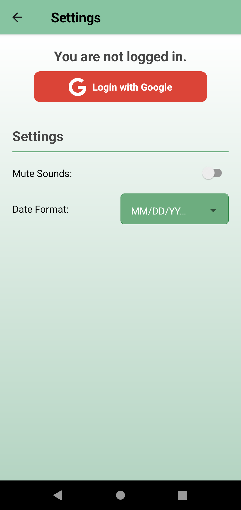
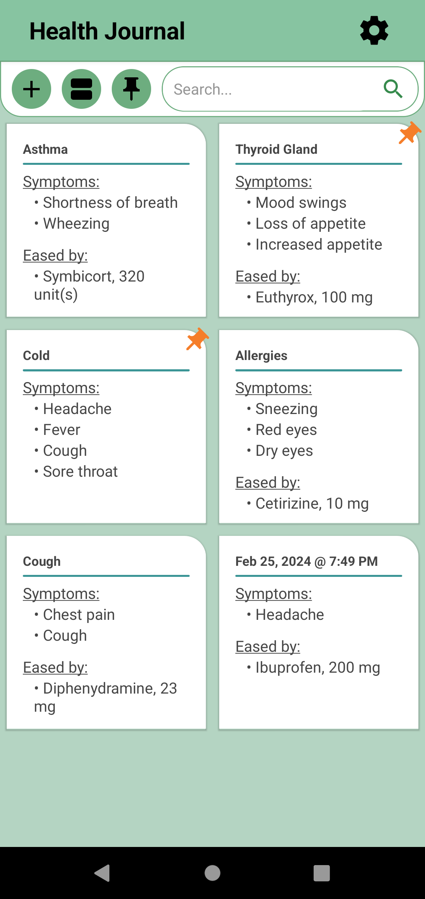
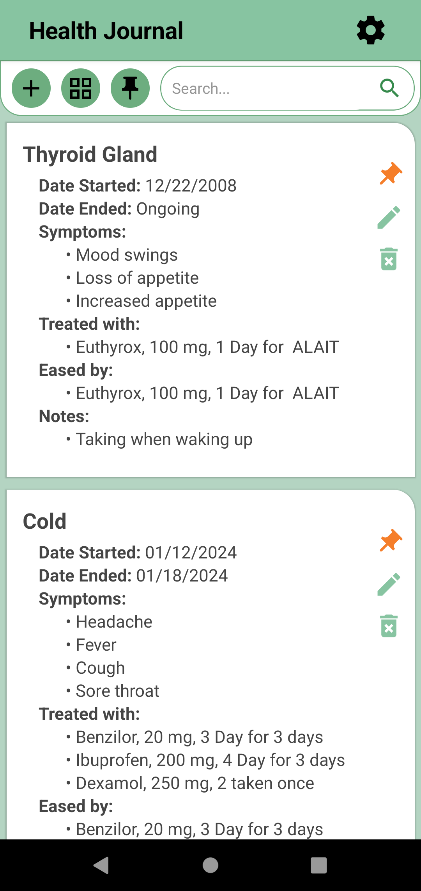

# HealthBook
A personal health journal app built with React Native v0.73.

This app is built using:
* TypeScript
* Redux
* Firebase
  
# Screenshots

  
  
  
  

## APK file download
[Click to download](https://github.com/Meta704/HealthBook/releases/download/HealthBook/HealthBook.apk)

# License
[MIT License](LICENSE)

Built & designed by Meishar Tal
